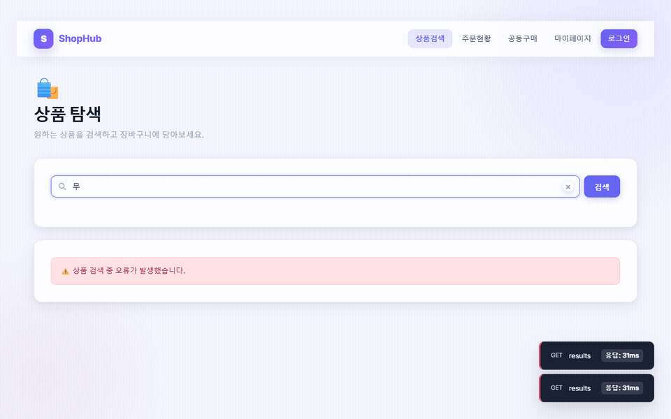
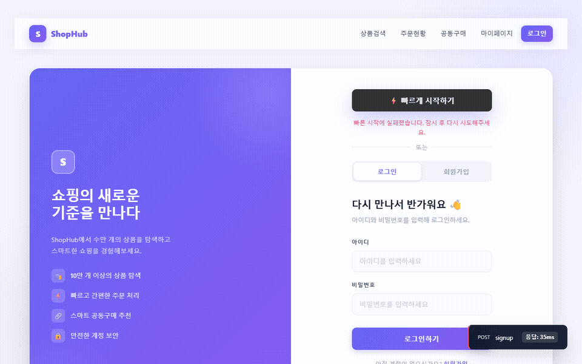
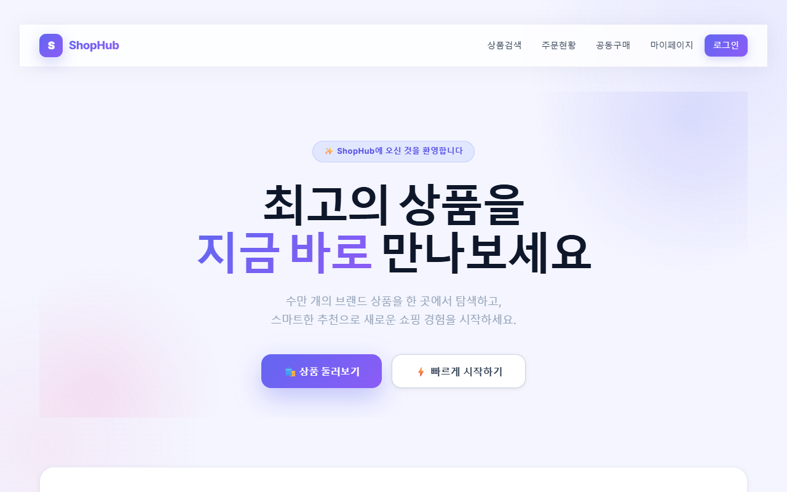
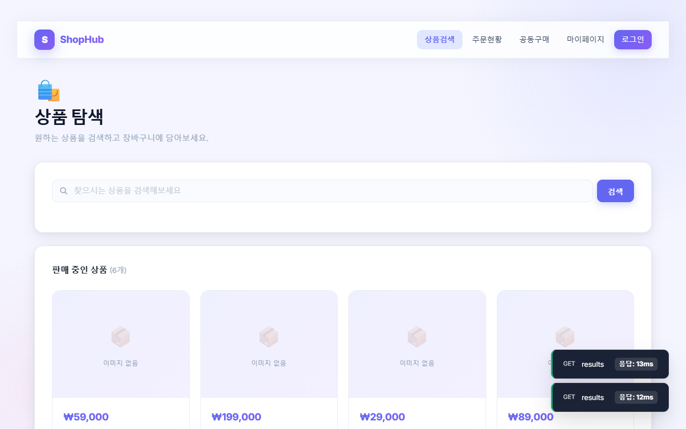
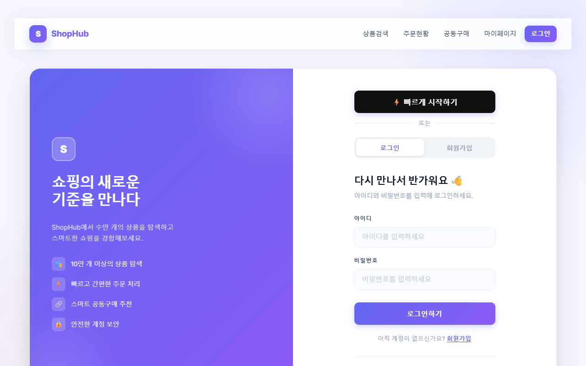
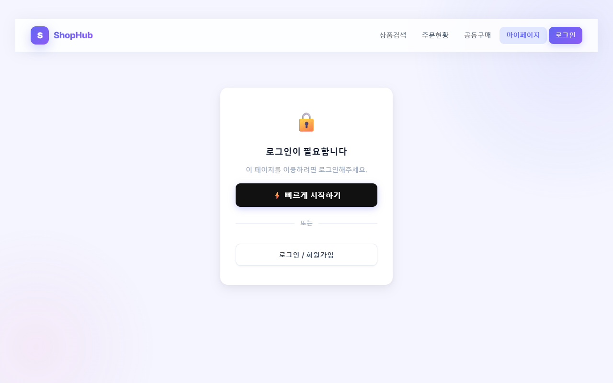

<div align="center">

# ShopHub 🛍️

### 이커머스 프론트엔드

[](https://www.ecommerce.p-e.kr)
[]()
[]()

</div>

---

## 📝 소개

Spring Boot 백엔드와 연동하는 이커머스 SPA.
상품 탐색, 장바구니, 주문, 공동구매 분석, 회원 관리 기능을 제공합니다.

---

## 📺 화면 구성

| 검색 자동완성 | 빠르게 시작하기 |
| :---: | :---: |
|  |  |
| 키워드 입력 → 추천어 → 결과 목록 | 버튼 클릭 한 번으로 자동 로그인 |

| 홈 | 상품 탐색 |
| :---: | :---: |
|  |  |
| 히어로 섹션, 서비스 소개 | 전체 상품 페이징 목록 |

| 인증 | 로그인 필요 화면 |
| :---: | :---: |
|  |  |
| 로그인·회원가입 폼 | 비로그인 시 잠금 화면 |

---

## ⚙ 기술 스택

**Frontend**

[](https://skillicons.dev)

**Backend (연동)**

[](https://skillicons.dev)

**Infra**

[](https://skillicons.dev)

---

## 😡 기술적 이슈와 해결 과정

### 검색 추천어 클릭 후 목록이 다시 뜨는 버그

추천어 클릭 → `setKeyword(suggestion)` → 디바운스 300ms 후 API 재호출 → 추천 목록 재출력

```js
// 해결: 클릭 시 skipNextRef를 true로 세팅, 다음 디바운스 effect에서 건너뜀
const skipNextRef = useRef(false);

const handleSuggestionClick = (suggestion) => {
  skipNextRef.current = true;  // 다음 fetch 1회 스킵
  setKeyword(suggestion);
  onSearch(suggestion);
  setSuggestions([]);
};

useEffect(() => {
  if (skipNextRef.current) { skipNextRef.current = false; return; }
  // ... API 호출
}, [debouncedKeyword]);
```

### 추천어 중복 표시

백엔드가 동일 이름의 상품을 여러 개 반환 (상품 ID는 다름)

```js
// Set으로 이름 기준 중복 제거
const unique = [...new Set(response.data)];
setSuggestions(unique);
```

### 로그인 상태를 React가 모르는 문제

localStorage에만 토큰을 저장해서 로그인해도 네비 버튼이 바뀌지 않는 문제

```js
// AuthContext로 isLoggedIn 상태 관리
export function AuthProvider({ children }) {
  const [isLoggedIn, setIsLoggedIn] = useState(() => !!getAccessToken());
  const login  = (token) => { _setToken(token); setIsLoggedIn(true); };
  const logout = ()      => { _setToken(null);  setIsLoggedIn(false); };
  // ...
}
```

### CI 배포 실패 — Google Drive 용량 초과

빌드 결과물 업로드 단계에서 Google Drive 용량이 꽉 찬 것이 원인.
Drive 정리 후 재트리거로 해결.

---

## 🚀 로컬 실행

```bash
npm install
npm run dev
```

`.env`

```
VITE_APP_BACKEND_URL=http://localhost:8080
```

---

## 배포 흐름

```
push to master
  → CI (ubuntu-latest): npm build → rclone → Google Drive
  → CD (self-hosted)  : Google Drive → Nginx /html
```

secrets: `RCLONE_CONF_B64`

---

## 💁 만든 사람

[최지웅](https://github.com/creepereye1204)
